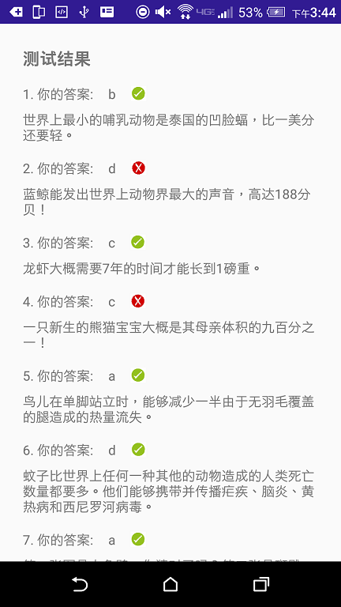

## Quiz App

#### Project Overview
The Quiz App project is a chance for you to combine and practice everything you learned in this section of the course. You will be making your own Android app - taking it from the idea stage to building out the full app. You can share your app with family and friends, as well as with other students in this course.

The goal is to create an educational app that quizzes a user about a certain topic of your choice. We want you to be creative about how you accomplish this. It’s up to you what the quiz questions will be about and how you want to present them to your user. (We recommend about 4 - 10 quiz questions for a reasonable scope of your app).

#### Why this project?
At this point, we believe that you’re now ready to create your own app. You will have full ownership over the creative vision, planning, and development of the app. From what we’ve seen in the discussion forums, you each have a wealth of different experiences and unique areas of expertise. We would like to see that shine through in the app that you create.

#### What will I learn?
This project is about combining various ideas and skills we’ve been practicing throughout the course. They include:

- Planning your app design before coding.
- Taking an app layout from drawing to XML code.
- Creating, positioning, and styling views.
- Creating interactivity through button clicks and Java code.
- Commenting and documenting your code.

#### Build Your Project
To complete this project, you'll need to design a quiz layout and implement it in an app. The quiz can be about any topic of your choice, and you are encouraged to create one on a topic you find personally interesting.

You'll want to build this project in steps.

First, build the layout. This involves creating the quiz questions, deciding what type of quiz they will be, and formatting them in the xml layout file for your Activity.

Second, you'll want to write code that links the layout to the activity. For step 3, you'll want variables that refer to each of the quiz answers.

Finally, write the code for the button which checks your answers. This code should run through each question in the app, record whether the user got the question right, and then display the quiz results in a Toast message.

### 1. App Design and Layout

My quiz app includes the following contents:

#### Starting Page

Including the name of the app, and a button for entering the quiz.


#### Introduction

A short paragraph introducing the quiz and a button for starting the quiz.


#### Quiz

Including 7 single-answer questions, 1 multiple-answer question and 2 blank-filling questions.

Single-answer questions use radio button groups where only one option is the correct answer.


Multiple-answer question uses checkbox view where multiple options may be correct.


Blank-filling questions use editText views.


#### Ending Page

Displaying score in a toast message and collecting user's name and email so that the quiz result can be sent to the user.  


#### Result page

A scrollView displaying a summary of the quiz, including which answers are correct or wrong. Providing the email option, too.


The App utilizes a combination of LinearLayout, RelativeLayout and ScrollView for the layout and a variety of textView, checkBox, radioButton, button, and editText for presenting different components of the app.

### 2. Technical Challenges

In addition to what we learned from the course, I have come across challenges when adding certain features to the app. Through research online, I found solutions to solving these problems.


#### Retain activity state when pressing back and forth

In App, users may want to go back to a previous activity to change his answer, and go back to where he left and continue to finish the quiz. Therefore, it is important to know how to retain activity state when pressing "PREV" and "NEXT" in the app.

To enable this feature, I added some code to the java scripts.

For example, in the java script of question 1:

```java

//goToPageTwo is associated with the "NEXT" button

public void goToPageTwo(View view) {

        Intent pageOne = new Intent(this, PageTwoActivity.class);　
        pageOne.addFlags(Intent.FLAG_ACTIVITY_REORDER_TO_FRONT);
        startActivity(pageOne);
    }

```

In question 2:

```java

//goToPageOne is associated with the "PREV" button

@Override
    public void onBackPressed(){
        Intent backIntent = new Intent(this,PageOneActivity.class);
        backIntent.addFlags(Intent.FLAG_ACTIVITY_REORDER_TO_FRONT);
        startActivity(backIntent);
    }


    public void goToPageOne(View view) {

        onBackPressed();
    }

```

"backIntent.addFlags(Intent.FLAG_ACTIVITY_REORDER_TO_FRONT)" sets the referred activity to the front of the stack without destroying the current activity. This enables the app to keep the state of activities and selected values of answers.

#### Pass variables to the result page activity

I use SharedPreferences to store and retrieve variables across activities. It is very helpful when there are multiple activities. By doing so, we don't need to pass the variable from the first activity to the second, and so on, until the last activity.

For example, in question 1:

```java

SharedPreferences sharedPref = PreferenceManager.getDefaultSharedPreferences(this);
        SharedPreferences.Editor editor = sharedPref.edit();
        editor.putString("answerOne",answerOne);
        editor.putBoolean("answerOne_Correct",answerOne_Correct);
        editor.apply();

```


Then, to retrieve the data in the last activity:

```java

SharedPreferences sharedPref = PreferenceManager.getDefaultSharedPreferences(this);
        String answerOne = sharedPref.getString("answerOne","");
        Boolean correctOne = sharedPref.getBoolean("answerOne_Correct",false);

```

### 3. Feedback

I showed my app to my husband. He suggested keeping the state of activities when clicking "PREV" and "NEXT". He also suggested me to add "RESTART" so that user can start over at the end without quitting the app or clicking backwards all the way to the start page.

To restart, I use the following code:

```java

  public void goToStart(View view) {
        SharedPreferences sharedPref = PreferenceManager.getDefaultSharedPreferences(this);
        sharedPref.edit().clear().commit();

        Intent pageEight = getBaseContext().getPackageManager().
        getLaunchIntentForPackage(getBaseContext().getPackageName());
        pageEight.addFlags(Intent.FLAG_ACTIVITY_CLEAR_TOP);
        pageEight.addFlags(Intent.FLAG_ACTIVITY_NEW_TASK);
        startActivity(pageEight);

    }

```

### 4. A Second Lauguage Version

I also made a Chinese version of this app:




### 5. Video

[video](https://www.youtube.com/watch?list=PLwoHPwmbSEX6c9orX_FaHM4fMoNptTBWf&v=9OnpXRcRWlQ)
